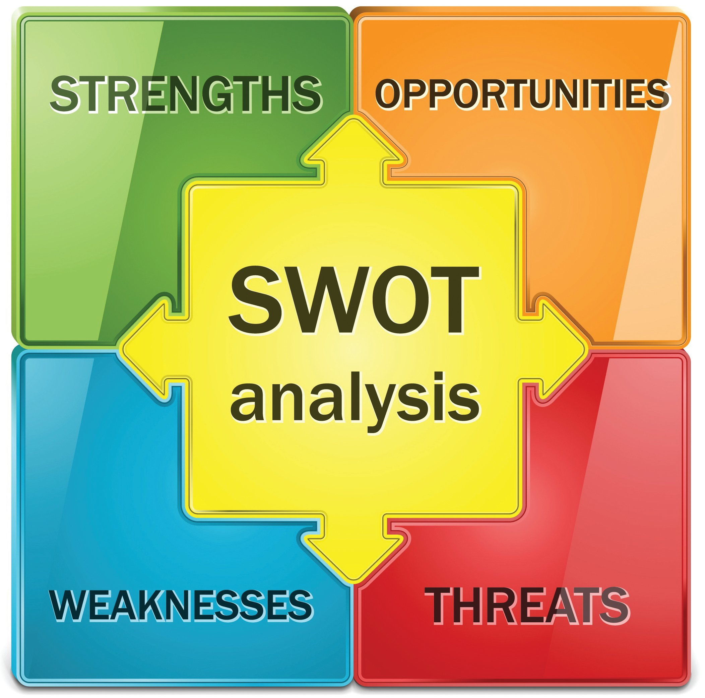

# Description
Last few years have been challenging for everyone of us due to "CORONA".So many of the biotech companies have been woking to make vaccines available to everyone.So government is planning to make it simple to everyone.So here i proposed a design that instead of making complex creating a local servers which can be done quickly and efficiently which also decrease the chance of crashing and hacking.So this project helpful for registering vaccine easily and quickly.
# Requirements
As we know due to heavy population there will be more number of people getting registering for vaccines so the number of people getting registered and number of people completed vaccination will be more so there will be chance of server crash.Here this project helps to create a local servers where the user get registered after reaching the max server reach it connects to main server and corresponding to this each vaccine centre will operate locally  and this can be done online and whatever the vaccine he required can register in this local server.Here the registrations can be done on day time and data acquired can be done on night.Once the registration and after successful verification the data is kept for future use.

## High Level Requirements
|ID|Descrption|Status|
|--|----------|------|
|HR01|User can make registrations after the verification is successful|Implemented|
|HR01|User can make new registrations|Implemented|
|HR02|Two step authentication|Not implemented|
|HR03|Gap between doses|Not Implemented|

## Low Level Requirements
|ID|Description|Status|
|--|-----------|------|
|LR01|User can select required dose|Implemented|
|LR02|Can able to see how many doses completed|Implemented|
|LR03|Can able to know vaccines are available or not in that area|Not implemented|
## SWOT

## Strength
*Stength of this project is to vaccinate people by registering to the vaccines using thier government id proof.Also helps to make the vaccination process simplier and efficiently.
## Threat
*Threat here is there is no Two step authentication done and many of the users using thier personal data for verification.
## Weakness
*Weakness is  no security and no linkage of our mobile to govt proof.
## Opportunities
*Opportunity is we can know how many vaccines are available and how many are not.
        
## 4W's & 1H 
### Who
User must get vaccinated
### What
To verify the user registered data.
### When
It is done when the date is allotted.
### Where
At the vaccination centers

